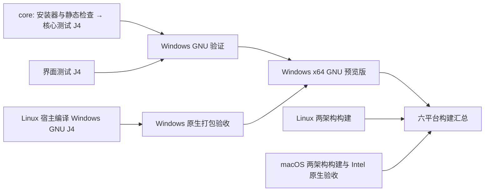

# Windows CI 并行验证与编译

Windows 预览 CI 使用 Linux 宿主交叉编译 GNU 产物，再交给 `windows-2022` 原生打包验收；core/ui Rust 测试仍在各自独立的 Windows runner 上以 `-j4` 执行。正式 Release 保留 Windows 原生编译。安装器与静态检查合并到 core 分片，在准备 Rust 环境前运行一次，保留 15 分钟步骤超时；失败会使 core 和验证聚合门禁失败。

- 核心分片保留 locale、community-build 更新器与 Shell 筛选；正式发布另含 product、version、config 检查。
- 界面分片保留完整 pager、minimal 和免费账户选项等筛选。相同 package 的后续过滤命令可复用已编译的测试程序。
- core 内的静态检查保留 PowerShell 5.1 / 7 安装器、包协议、PE 精简保护、发布策略、发布说明和预览元数据检查；格式检查也在核心分片运行。ui 分片不重复执行静态检查。
- `windows-gnu-validation` 和 `windows-gnu-preview` 保留原 ID 与检查名称作为聚合门禁。任一必需分片失败、取消或跳过都不会通过；矩阵关闭 fail-fast，让另一分片保留完整诊断。
- 编译制品可能早于测试完成上传；完整验收仍以 Windows 聚合检查和六平台汇总为准。

正式 Release 的验证矩阵与产物编译都只依赖 `release-plan`，检出同一个 `source_commit`，Rust 与构建显式使用相同发布版本。core 的静态检查使用该次检出的代码。`windows-x64-gnu-validation` 汇总 release-plan 和全部验证分片；原有 `release-attestations` 与 `release-publisher` 继续要求验证、编译成功，不能绕过失败、取消或跳过的验证。

## 共用准备与隔离边界

六平台预览中，Windows ARM64 MSVC 的更新器测试也使用独立原生 ARM64 runner，与产物构建并行；两个阶段均使用 J4，`multiplatform-result` 同时要求原生测试矩阵与 ARM64 制品成功。正式 Release 继续在完整 action 中顺序验证。ARM64 只缓存 registry/git 与 host/target `release-dist`，不保存测试 debug 目录；同仓非 Dependabot PR 和 zh-dev 预览可写，正式 Release 只读。Cargo timings 作为独立诊断制品上传。六平台提速基线与验收口径见 [macOS 构建说明](MACOS-CI-PERFORMANCE.md#六平台预览提速2026-09-26)。

Windows Rust 分片、原生产物验收和正式编译作业调用 `.github/actions/setup-windows-gnu`，统一版本及固定 Rust / MinGW / protoc，恢复 Cargo registry/git，并各自在自己的 runner 获取依赖。core 先完成静态检查，再调用该准备步骤。预览交叉编译使用独立的 Linux host 工具链与缓存，配置见本页第三轮记录。

`.github/scripts/windows-validation-tests.json` 保存原有预览 12 条、发布 15 条 Cargo 命令的 package、feature 和过滤条件。各分片内部保留相对顺序；跨分片并行运行。不将多个 package 合成一条 Cargo 命令，避免 feature union 改变覆盖。

`.github/actions/validate-windows-gnu` 为 core/ui 分别缓存 `target/debug`。键包含 ref、OS/架构、Rust 工具链、target、GNU 编译器和链接器文件指纹、debug/incremental 配置、测试清单、Cargo manifests/build.rs/config/toolchain 与 lockfile。不同分片不互相恢复；允许从可访问的 zh-dev 缓存回退。编译作业仍分别使用 target/host `release-dist` 缓存，不恢复旧低优化 release 缓存。

zh-dev 和同仓库、非 Dependabot PR 的预览可以保存缓存；fork PR 和正式 Release 只读。同仓 PR 缓存实际属于 `refs/pull/<n>/merge`，供同一 PR 后续运行复用，不能供其他 PR 或主分支读取。Cargo registry/git 仍只由产物编译作业保存，避免同轮竞争。

缓存使用稳定配置键，不在每次提交后新增整份大缓存；已有键不可覆盖，后续源码变化仍会由 Cargo 检查并重编译。命中缓存不会跳过 Cargo build/test、版本检查或产物校验。配置变化或缓存淘汰后重新保存。仓库默认缓存容量有限，实际占用以 GitHub 压缩后大小衡量，不能把未压缩 debug 目录体积直接视为配额用量；需通过冷、暖两次运行检查收益及其他平台缓存是否被挤出。

长时间编译结束后，保存前会再次只查询原始 primary key；如果另一轮已经保存相同缓存，就跳过重复压缩。查询使用相同路径和缓存版本，不下载、不替换当前构建目录。查询与保存之间仍可能发生竞态，由缓存服务最终决定是否接受。Windows 准备阶段同时将 CPU 型号、逻辑核数、内存与 runner image 写入 Cargo timings 制品中的 `runner-hardware.json`，用于解释托管 runner 的耗时差异。

分片会重复部分冷依赖编译，可能增加总 runner 分钟数；缩短验证墙钟时间不代表减少计算量。`-j4`、测试断言、功能组合以及产物 Thin LTO/opt-level=3 保持不变。整个 CI 仍可能受 Windows 产物编译、其他平台或排队限制。

Windows 继续直接调用 Rust 编译器，使用上述 Cargo 依赖、target 和 host 缓存。额外的 256 MiB sccache 试验在同版本复测及后续新版本构建中均为 97 次 miss、0 次 hit，未显示可保留的收益，因此已撤回启动器、工具下载、归档恢复和诊断步骤。原有 Cargo 缓存、测试及包保护不受影响，共享缓存未删除。最新观测的归档只保留 19 个对象；这不能单独证明未命中的原因，也不把不同托管 runner 的编译时间差归因于缓存读写。

推送、PR 更新和手动触发的 CI 默认并行运行：每轮以 `github.run_id` 使用独立并发组，并设置 `cancel-in-progress: false`。新一轮不会自动取消同分支旧轮，也无需 `parallel_run` 开关。GitHub runner 配额不足时仍可能排队；验收需核对制品运行 ID 与源码提交。

## Windows 产物体积与运行性能

预览与正式 Release 都使用上游 `release-dist` 编译 profile 和同名 feature。该 profile 启用 Thin LTO、`codegen-units=1`，继承 release 的 `opt-level=3`；不再将 shell 降为 `opt-level=1`。仅覆盖 `profile.release-dist.debug=0`，避免生成不随包发布的调试行号信息。根 Cargo.toml、目标架构、CPU 基线、功能集合和运行协议保持不变。

这一选择优先保证运行时优化，可能增加编译和链接时间；不使用 `opt-level=s/z`、可执行文件压缩壳或删减功能来换体积。Thin LTO 的实际体积、内存和性能收益以真实构建和回归结果为准，不能用编译参数代替测量。首次切换配置需要重新生成 target/host 编译缓存。

`.github/scripts/strip-windows-binary.py` 只从未剥离的构建 EXE 生成发布副本，清除普通 COFF 符号和调试节。脚本逐项比较运行节的原始字节、入口、导入/导出目录、异常展开目录及安全属性；改变运行内容、残留普通符号、体积增大或 CLI 冒烟失败都会阻止打包。C 依赖可能在 Cargo `debug=0` 时仍携带 DWARF：检查允许删除不可执行、不可写且可丢弃的 `.debug_*` / `.zdebug_*` 节，并验证 PE 总容量及运行目录不引用这些节。原构建文件保留符号，并用 `--only-keep-debug` 导出安装包外的独立符号文件；CI 单独上传保留 14 天的诊断制品，清单记录源码提交以及原始 EXE、发布 EXE 和符号文件的 SHA-256。发布副本的原生回溯符号名称可能减少，独立符号供离线排查使用。此步骤必须先于签名和 SHA256SUMS 生成。

剥离后的 EXE 在独立临时 `GROK_HOME` 下运行 `--version`、`--help`、`agent --help` 和 `update --help`。这些检查覆盖启动和命令入口，不等于真实账号、工具调用或 TUI 性能验收；Windows 原有全部 Cargo 和安装器测试继续保留。

正式 ZIP 使用 .NET `SmallestSize` 的标准 Deflate，预览 Artifact 使用压缩等级 9。两者都保持单层压缩、原文件集合和既有解包器兼容；现代 ZIP 的单一顶层目录、旧桥接包的扁平布局、包内协议与双层哈希保持不变。压缩等级只影响打包/解包阶段，不增加 EXE 运行时解压开销。

### 本地实测（2026-09-21）

在源码提交 `6d3c700eea8015e67975f7ee6d8051da16c08ec9` 上使用 Rust GNU 1.94.0、GCC 16.1、`-j2` 构建，实际完成耗时 42 分 10 秒。下表的旧包来自已发布的 `release-v1.0.35`（提交 `6b36b84032b58f27dd3d4c84e0abbcabf1d897ef`）；新包是本地验证产物，尚未发布。由于源码提交、工具链环境也有差异，这不是仅改变 profile 的严格 A/B 实验。

| 产物 | 已发布旧包 | 本地优化后 | 减少 |
| --- | ---: | ---: | ---: |
| EXE | 319,811,025 字节（305.0 MiB） | 154,060,800 字节（146.9 MiB） | 51.8% |
| 完整 ZIP | 110,985,696 字节（105.8 MiB） | 64,804,099 字节（61.8 MiB） | 41.6% |

同一旧 EXE 单独剥离符号后为 238,287,872 字节（227.2 MiB），运行节及加载参数一致：这一项可明确归因于移除符号。官方 npm 1.0.35 解压后的 Windows EXE 为 151,999,488 字节（145.0 MiB）；官方使用不同的封装和构建链，不能直接比较 npm 压缩包与本项目 ZIP。

四个 CLI 入口各做 15 次交错暖启动测量，旧包中位数约 199–207 ms，新包约 103–108 ms；三个帮助输出的 SHA-256 与旧包相同。这只覆盖启动和帮助，不代表 TUI 渲染、模型请求或工具吞吐性能。220 项更新器测试、两版 PowerShell 的安装器测试均通过；实际新 ZIP 在 PowerShell 5.1/7 下通过在线安装器纯解包函数的全文件哈希、15 项载荷集合和 EXE 版本校验。上述体积优化已在 [CI 35600409386](https://github.com/JoyElliot/grok-build-Chinese/actions/runs/35600409386) 完成三端验证；分片与缓存提速另行测量。

## Windows 验证编译配置

预览和正式 Release 的验证作业都设置 `CARGO_PROFILE_TEST_DEBUG=0`，省去 workspace 测试编译原本继承自 dev profile 的 `line-tables-only` 调试信息；第三方依赖原本已关闭该信息。这会减少测试产物生成与链接的数据量，具体耗时收益以 CI 对比为准。测试的优化级别、debug assertions 和溢出检查保持原配置，运行时回溯中的源码行号信息可能减少；本地开发和产物编译不受此作业环境变量影响。

各分片由 `run-windows-validation.ps1` 顺序执行原始测试选择，保留 `--frozen --timings`。每条命令记录参数、退出码和墙钟时间；首条失败即终止该分片，其他矩阵分片继续。CPU、内存及目标盘每 5 秒采样；诊断包含主机 CPU 型号、缓存命中键、提交、版本和 debug 目录统计。

无论测试成败，都上传 `grok-zh-windows-validation-<preview|release>-<core|ui>-<run_id>-<run_attempt>`，其中包含 Cargo HTML timings、`summary.json`、`resources.json` 和监控 CSV。统计失败时体积为 null；准备阶段失败可能没有诊断目录。产物编译诊断保持独立，均不进入安装包。正式发布提速以下次正常发布验证，不为测试重发旧版本。

## 本轮优化前基线

[CI 35600409386](https://github.com/JoyElliot/grok-build-Chinese/actions/runs/35600409386)，提交 `44924dfbd8d3bc3432d806636fef5b9156caac53`，三端成功：

| 阶段 | 耗时 |
| --- | --- |
| Windows 全部验证 | 55 分 38 秒 |
| Windows 编译打包 | 50 分 30 秒 |
| 其中 release-dist 编译 | 48 分 50 秒 |
| 整轮 CI | 55 分 56 秒 |

12 条 Cargo 命令通过 529 项测试，测试函数耗时合计约 2.18 秒；Cargo 编译阶段合计约 51 分 43 秒。只有 5 条命令产生实际编译，其余复用测试程序。因此优化重点为拆分编译路径与恢复缓存，删除测试过滤命令几乎不能缩短这轮构建。旧验证 debug 目录未压缩约 11.69 GiB，新分片缓存压缩大小及实测提速以本轮 CI 为准。

## 串行基线

基线为 [CI 34709545996](https://github.com/JoyElliot/grok-build-Chinese/actions/runs/34709545996)，提交 `e84eb5af2ed8410458f205d0cecff4ad4d63a1d5`。该轮三端构建和汇总全部成功。

| Windows 阶段 | 耗时 |
| --- | --- |
| 本地化验证及测试编译 | 43 分 45 秒 |
| 产物编译及资源监控 | 33 分 17 秒 |
| 整个 Windows 作业 | 81 分 44 秒 |

并行收益须以新 CI 中各个 Windows 作业的开始/结束时间、同阶段日志和最终汇总时间验证；两个作业各自进行准备和依赖恢复，不能直接把基线的两个阶段相减当作实际收益。

## 六平台第三轮：Windows GNU 交叉编译试验

第二轮 [CI 36172021045](https://github.com/JoyElliot/grok-build-Chinese/actions/runs/36172021045) 全部成功，但从 `2026-09-25T18:13:13Z` 创建到 `19:12:22Z` 完成为 **59 分 09 秒**；Windows x64 GNU 作业为 **58 分 49 秒**。Intel 交叉编译和原生产物验收已在工作流创建后 43 分 34 秒内完成，Windows GNU 成为本轮最长路径。

第二轮 Windows GNU Cargo 为 **55 分 49.1 秒**，324 Fresh / 1040 Dirty；target 缓存精确命中，但 home/host 缓存未命中，不能将其视为完全暖构建。最慢单元是最终 binary（973.3 秒）与 shell（940.4 秒）。宿主为 AMD EPYC 7763，暴露 2 核/4 逻辑处理器；系统 CPU 平均 75.50%，内存使用峰值 69.67%。外部 `ld` 仅在两个相隔约 14 分钟的样本中出现，没有长时间驻留证据。该轮的缓存和宿主均与前一轮不同，不能把全部差异归因于 CPU 型号。

上一轮 `36164317702` 的 Windows GNU Cargo 为 35 分 56.8 秒，1254 Fresh / 110 Dirty；主要耗时单元为 shell（932.7 秒，其中 codegen 775.7 秒）和最终 binary（895.5 秒），并行单元时间不可相加。外部 `ld` 只出现在两个连续采样点，缺少长时间外部链接的证据。因此第三轮优先实测 Linux 编译宿主，保留 Rust 1.94.0、`x86_64-pc-windows-gnu`、`release-dist`/Thin LTO/opt-level=3/codegen-units=1/debug=0 和全部 features。

新 `.github/actions/build-windows-gnu-cross` 使用 Ubuntu 24.04 的 MinGW POSIX 工具链，只设置 target 专属 CC/CXX/AR/linker；Linux build scripts/proc macros 保留宿主编译器，protoc 仍为经过哈希验证的 29.3 宿主版本。Rust 1.94.0 的[官方 GNU 目标文档](https://github.com/rust-lang/rust/blob/1.94.0/src/doc/rustc/src/platform-support/windows-gnu.md)支持交叉编译；本项目原生 C 依赖的实际兼容性及耗时仍需本轮 CI 验证。

跨 job 只传递未裁剪 EXE 和构建身份清单，原生 Windows job 核对提交、版本、目标、profile、features 和 SHA-256 后，执行原有 PE 运行节保护、符号分离、CLI 冒烟、打包、文件哈希和更新协议生成。CLI 验证的 PATH 限于 Windows 系统目录，防止 MinGW 工具目录中的运行库掩盖安装包缺少 DLL。完整 core/ui 测试继续在 Windows 原生执行；最终门禁必须同时通过交叉编译、原生产物验收及两组测试。

交叉构建缓存与原生 Windows 缓存隔离，包含实际 MinGW 包版本和编译器文件指纹，只缓存依赖源和 host/target `release-dist`，不新增 debug 缓存。诊断制品保留 Cargo timings、工具链/CPU 信息及 `/usr/bin/time -v`；其 maximum RSS 是工具报告的进程内存指标，与旧 Windows 进程树采样值不可直接等同。首次试验是独立冷缓存，后续仍须用新 CI 版本复验整轮时长。

第三轮初次 `36180568215` 在依赖预取只限定 Windows target 后，冻结构建缺少 `aligned-vec 0.6.4`；修复为完整 `cargo fetch --locked`，保留后续 `--frozen`。修复提交 `dba0c88d` 的 [CI 36180846184](https://github.com/JoyElliot/grok-build-Chinese/actions/runs/36180846184) 中，Linux 上的 Windows GNU 编译作业于 `19:37:51Z–19:59:52Z` 成功，耗时 **22 分 01 秒**。但原生打包在 PE 比较时失败，尚不能认定 Windows 产物通过。

对这轮原始 EXE 的本地复现发现，普通 GNU `strip --strip-all` 清除了 `.idata` 和 `.CRT` 的 `IMAGE_SCN_MEM_WRITE`，其他已比较的运行数据保持一致；现有门禁正确拒绝了这一变化。修复必须保留原节权限，并继续使用完整运行映像比较与 Windows 隔离 CLI 验收，不能忽略权限差异。

该轮 Cargo timings 为 **20 分 24 秒**、1363 Dirty / 0 Fresh，两类起始缓存均 miss。宿主为 AMD EPYC 9V45、4 CPU，MinGW GCC 13-posix / GNU ld 2.41.90.20240122；`time -v` 报告 CPU 295%、最大 RSS 7,833,268 kB。依赖和编译缓存首次保存分别约 15.0 秒、19.5 秒。该结果证明这一轮冷编译已低于 50 分钟，但整轮验收因打包失败仍未达标。

预览 GNU 打包显式启用 `--preserve-mingw-write-permissions`：仅允许从原本 `0xC0000040` 的 `.idata` / `.CRT` 恢复被工具清除的写位；写入前必须证明除此之外完整运行映像、符号与体积约束均满足，且暂存文件 SHA 未变。写入后重算 PE checksum，再次执行原有完整映像比较及四个 CLI 冒烟。其他 section、权限位、代码、加载参数等变化仍失败。正式 Release 不启用此选项。

使用这轮实际 EXE、本机 GNU Binutils 2.47.20260726 的完整脚本验证通过：输入 190,342,249 字节、发布副本 153,997,824 字节，原始 EXE 哈希与制品清单相符，运行映像完全一致，隔离 PATH 下 `--version`、`--help`、`agent --help`、`update --help` 均成功；重算 checksum 与 Windows `CheckSumMappedFile` 一致。修复后的 CI runner 打包结果仍需新一轮验证。

## 首次六平台整轮低于 50 分钟

提交 `1c7a1931` 的 [CI 36186573449](https://github.com/JoyElliot/grok-build-Chinese/actions/runs/36186573449)，版本 `1.0.35-zh.ci.136`，从 `2026-09-25T20:34:22Z` 创建至 `21:20:41Z` 工作流完成，共 **46 分 19 秒**。六平台产物、五平台独立原生测试、Windows core/ui、Windows 汇总及六目标最终汇总全部成功；同步资料完整性成功，真实账号 macOS 冒烟按条件跳过。该时长包含排队、准备、缓存保存、上传和最终汇总。

| 产物路径 | 作业耗时 | 原生产物验收 |
| --- | --- | --- |
| Windows x64 GNU Linux 交叉编译 | 15 分 44 秒 | Windows 打包 1 分 36 秒；工作流创建后 17 分 27 秒完成 |
| Windows ARM64 MSVC | 46 分 09 秒 | 同一原生作业完成 |
| Linux x64 GNU | 26 分 41 秒 | 同一原生作业完成 |
| Linux ARM64 GNU | 35 分 02 秒 | 同一原生作业完成 |
| macOS ARM64 | 21 分 02 秒 | 同一原生作业完成 |
| macOS Intel 交叉编译 | 40 分 17 秒 | Intel 原生验证 32 秒；工作流创建后 41 分 01 秒完成 |

Windows 原生打包日志确认 `.idata` / `.CRT` 原权限已恢复，`runtime_image_unchanged` 和 `cli_smoke_passed` 均为 true。Windows core/ui 分片分别为 32 分 22 秒、24 分 58 秒，Windows 最终验收于 `21:07:00Z` 成功。该轮首次达标，仍需用另一实际新 CI 版本复验，不能仅凭一次成功认定稳定达标。

最长的 Windows ARM64 路径是冷编译：Cargo **42 分 38.5 秒**、1360 Dirty / 0 Fresh。Cargo home 命中并耗时 69.784 秒恢复，但编译产物缓存未命中；本轮结束后保存约 1.357 GB 的编译缓存，耗时 57.697 秒。最慢单元为 shell（864.9 秒，codegen 723.1 秒）和最终 binary（668.1 秒）。这些测量支持进一步验证缓存保留效果，尚不支持量化调整并发度或编译 profile 的收益。

其余平台的 Cargo 缓存条件如下；命中缓存并不意味着跳过工作区编译，内嵌 CI 版本每轮更新。

| 平台 | home / target / host | Fresh / Dirty | Cargo 耗时 |
| --- | --- | ---: | --- |
| Windows x64 GNU | home、合并编译缓存命中 | 1253 / 110 | 14 分 11.2 秒 |
| macOS Intel | 三类均未命中 | 0 / 1411 | 35 分 18.1 秒 |
| macOS ARM64 | 三类均命中 | 1300 / 110 | 19 分 03.3 秒 |
| Linux x64 GNU | 三类均命中 | 1342 / 110 | 25 分 10.6 秒 |
| Linux ARM64 GNU | home、target 命中，host 未命中 | 301 / 1150 | 33 分 24.2 秒 |

### 下一轮：减少 PR 测试缓存占用并复验

完成首轮后，仓库 cache usage API 报告约 10.92 GB；随后列表中 PR #8 的 core/ui debug 缓存分别为 1,710,612,385 和 1,965,748,249 字节，合计约 **3.676 GB**。同时 Intel 三类缓存与 Windows ARM64 编译缓存本轮未命中，并在结束时重新保存。GitHub [缓存规则](https://docs.github.com/en/actions/reference/workflows-and-actions/dependency-caching)说明达到仓库配置的存储上限后会按最后访问时间淘汰；本次没有读到该仓库的实际额度，故目前只能把容量竞争视为待验证原因。

下一轮只停止 PR 的 Windows core/ui debug 缓存写入，恢复逻辑、完整测试选择及全部门禁保持不变。`zh-dev` 仍保存这两份缓存，保留其作为后续预览与正式 Release 的恢复来源；正式 Release 原本就不保存测试缓存。仅清理 PR #8 已确认的这两份派生 debug 缓存，让复验能直接观察减少占用后的结果，不清理其他 ref、生产缓存或历史制品。需要核对下一实际 CI 版本的测试冷编译耗时、生产缓存命中/Dirty 数和整轮完成时间；不预设这项调整一定提速。
