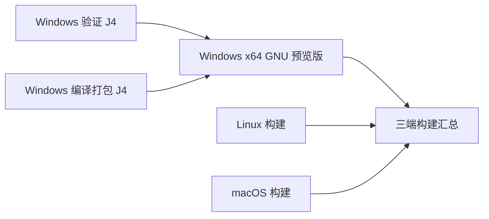

# Windows CI 并行验证与编译

Windows 预览 CI 和正式 Release 都将验证与产物编译分成两个独立的 `windows-2022` 作业。每个作业分配自己的 GitHub 托管 runner、CPU、内存和临时目录，各自使用 `-j4`；验证与编译之间没有 `needs` 依赖。

- `windows-gnu-validation` 保留 Windows PowerShell 5.1 / PowerShell 7 安装器测试、包协议、发布策略、发布说明、本地化检查及全部 12 条 Cargo 测试命令。
- `windows-gnu-build` 保留预览编译参数、资源监控、包内协议与文件清单、打包和制品上传。编译与验证使用相同的 CI 版本号和工具链。
- 原来的 `windows-gnu-preview` ID 和“Windows x64 GNU 预览版”名称作为聚合检查保留。它在两个作业结束后执行；任一结果为失败、取消或跳过时，该检查失败。三端汇总继续依赖它。
- 编译制品可能先于验证作业完成上传；完整验收以 Windows 聚合检查和三端汇总结果为准。

正式 Release 使用 `windows-x64-gnu-validation` 与 `windows-x64-gnu`，两者都只依赖 `release-plan`。验证作业保留原有 15 条 Cargo 测试命令、发布说明、格式、包协议、发布策略及 PowerShell 5.1/7 安装器检查；编译作业保留正式 ZIP 打包、哈希和版本冒烟。`release-attestations` 与 `release-publisher` 均显式要求验证、编译成功，验证失败、取消或跳过时不能生成发布证明或发布 Release。三端仍并行构建。

预览与正式验证都运行 `python .github/scripts/tests/test_release_workflow.py`，覆盖发布依赖失败、取消、跳过及旧版桥接例外，防止验证与编译拆分后绕过发布门禁。

## 共用准备与隔离边界

预览与正式的 Windows 作业共同调用 `.github/actions/setup-windows-gnu`，统一选择版本、准备固定 Rust / MinGW / protoc、恢复 Cargo registry/git，并各自在自己的 runner 获取依赖，以满足后续 `--frozen` 调用。正式作业检出 `release-plan` 校验的提交，并显式传入 Tag 对应版本，不生成 CI 版本号。

验证作业只读取依赖缓存，不恢复或写入产物编译缓存。编译作业分别缓存 target / host 的 `release-dist` 目录，键包含 `release-dist-ltothin-debug0-cgu1-opt3-feature-release-dist`，不回退恢复旧的低优化 `release` 产物。正式作业在摘要中记录精确命中和实际恢复的键，仅受信任预览作业保存缓存，避免并行写入竞争。测试 feature 和增量开关保持原配置。

两个作业的 `-j4` 不竞争同一台 runner 的 CPU。将编译降到 `-j2` 不会给独立的验证 runner 增加资源；应先根据两组实际耗时评估，并计入 Linux、macOS、准备和排队时间。并行缩短的是等待时间，并不等于减少总计算量。

手动触发工作流时，可启用 `parallel_run`，让本轮使用包含运行 ID 的独立并发组，保留同分支仍在执行的其他 CI。该开关默认关闭，日常推送和普通手动触发继续沿用原来的同分支取消规则。不同运行的制品带各自运行 ID，验收时仍需核对对应提交。

## Windows 产物体积与运行性能

预览与正式 Release 都使用上游 `release-dist` 编译 profile 和同名 feature。该 profile 启用 Thin LTO、`codegen-units=1`，继承 release 的 `opt-level=3`；不再将 shell 降为 `opt-level=1`。仅覆盖 `profile.release-dist.debug=0`，避免生成不随包发布的调试行号信息。根 Cargo.toml、目标架构、CPU 基线、功能集合和运行协议保持不变。

这一选择优先保证运行时优化，可能增加编译和链接时间；不使用 `opt-level=s/z`、可执行文件压缩壳或删减功能来换体积。Thin LTO 的实际体积、内存和性能收益以真实构建和回归结果为准，不能用编译参数代替测量。首次切换配置需要重新生成 target/host 编译缓存。

`.github/scripts/strip-windows-binary.py` 只从未剥离的构建 EXE 生成发布副本，清除普通 COFF 符号和调试节。脚本逐项比较运行节的原始字节、入口、导入/导出目录、异常展开目录及安全属性；改变运行内容、残留普通符号、体积增大或 CLI 冒烟失败都会阻止打包。C 依赖可能在 Cargo `debug=0` 时仍携带 DWARF：检查允许删除不可执行、不可写且可丢弃的 `.debug_*` / `.zdebug_*` 节，并验证 PE 总容量及运行目录不引用这些节。原构建文件保留符号，并用 `--only-keep-debug` 导出安装包外的独立符号文件；CI 单独上传保留 14 天的诊断制品，清单记录源码提交以及原始 EXE、发布 EXE 和符号文件的 SHA-256。发布副本的原生回溯符号名称可能减少，独立符号供离线排查使用。此步骤必须先于签名和 SHA256SUMS 生成。

剥离后的 EXE 在独立临时 `GROK_HOME` 下运行 `--version`、`--help`、`agent --help` 和 `update --help`。这些检查覆盖启动和命令入口，不等于真实账号、工具调用或 TUI 性能验收；Windows 原有全部 Cargo 和安装器测试继续保留。

正式 ZIP 使用 .NET `SmallestSize` 的标准 Deflate，预览 Artifact 使用压缩等级 9。两者都保持单层压缩、原文件集合和既有解包器兼容；现代 ZIP 的单一顶层目录、旧桥接包的扁平布局、包内协议与双层哈希保持不变。压缩等级只影响打包/解包阶段，不增加 EXE 运行时解压开销。

### 本地实测（2026-09-21）

在源码提交 `6d3c700eea8015e67975f7ee6d8051da16c08ec9` 上使用 Rust GNU 1.94.0、GCC 16.1、`-j2` 构建，实际完成耗时 42 分 10 秒。下表的旧包来自已发布的 `release-v1.0.35`（提交 `6b36b84032b58f27dd3d4c84e0abbcabf1d897ef`）；新包是本地验证产物，尚未发布。由于源码提交、工具链环境也有差异，这不是仅改变 profile 的严格 A/B 实验。

| 产物 | 已发布旧包 | 本地优化后 | 减少 |
| --- | ---: | ---: | ---: |
| EXE | 319,811,025 字节（305.0 MiB） | 154,060,800 字节（146.9 MiB） | 51.8% |
| 完整 ZIP | 110,985,696 字节（105.8 MiB） | 64,804,099 字节（61.8 MiB） | 41.6% |

同一旧 EXE 单独剥离符号后为 238,287,872 字节（227.2 MiB），运行节及加载参数一致：这一项可明确归因于移除符号。官方 npm 1.0.35 解压后的 Windows EXE 为 151,999,488 字节（145.0 MiB）；官方使用不同的封装和构建链，不能直接比较 npm 压缩包与本项目 ZIP。

四个 CLI 入口各做 15 次交错暖启动测量，旧包中位数约 199–207 ms，新包约 103–108 ms；三个帮助输出的 SHA-256 与旧包相同。这只覆盖启动和帮助，不代表 TUI 渲染、模型请求或工具吞吐性能。220 项更新器测试、两版 PowerShell 的安装器测试均通过；实际新 ZIP 在 PowerShell 5.1/7 下通过在线安装器纯解包函数的全文件哈希、15 项载荷集合和 EXE 版本校验。远程 CI 尚未运行。

## Windows 验证编译配置

预览和正式 Release 的验证作业都设置 `CARGO_PROFILE_TEST_DEBUG=0`，省去 workspace 测试编译原本继承自 dev profile 的 `line-tables-only` 调试信息；第三方依赖原本已关闭该信息。这会减少测试产物生成与链接的数据量，具体耗时收益以 CI 对比为准。测试的优化级别、debug assertions 和溢出检查保持原配置，运行时回溯中的源码行号信息可能减少；本地开发和产物编译不受此作业环境变量影响。

原有 12 条 Cargo 测试命令的 package、feature、过滤条件和顺序全部保留，按本地化运行库、更新器、Shell、完整界面、精简界面及免费账号选项拆分为独立步骤。每条命令增加 `--timings`，运行结束后上传 `grok-zh-windows-validation-<run_id>-<run_attempt>`，包含 Cargo 生成的 HTML 编译报告和 `summary.json`。后者记录提交、运行次数、验证配置、debug 目录文件数及未压缩总字节数；测试中途失败时也会尽力收集，目录不存在或统计失败时体积保持 `null`。

正式 Release 的 15 条 Cargo 测试保持原顺序并增加 `--timings`，验证诊断为 `grok-zh-windows-release-validation-<run_id>-<run_attempt>`；产物编译 timings 单独上传为 `grok-zh-windows-release-build-<run_id>-<run_attempt>`。这些诊断不进入安装包。正式流程改动的实际提速以下次正常发布为准，不为验证耗时重发已有版本。

当前没有 Windows debug 编译缓存。先通过诊断制品确认编译热点及目录体积，再评估缓存容量与恢复收益；未压缩目录体积不能直接作为实际缓存占用。对比时将拆分后的元数据与测试步骤耗时合计，与原来的单一步骤比较，并分别记录整个验证作业和 CI 汇总耗时。

## 串行基线

基线为 [CI 34709545996](https://github.com/JoyElliot/grok-build-Chinese/actions/runs/34709545996)，提交 `e84eb5af2ed8410458f205d0cecff4ad4d63a1d5`。该轮三端构建和汇总全部成功。

| Windows 阶段 | 耗时 |
| --- | --- |
| 本地化验证及测试编译 | 43 分 45 秒 |
| 产物编译及资源监控 | 33 分 17 秒 |
| 整个 Windows 作业 | 81 分 44 秒 |

并行收益须以新 CI 中两个 Windows 作业的开始/结束时间、同阶段日志和最终汇总时间验证；两个作业各自进行准备和依赖恢复，不能直接把基线的两个阶段相减当作实际收益。
